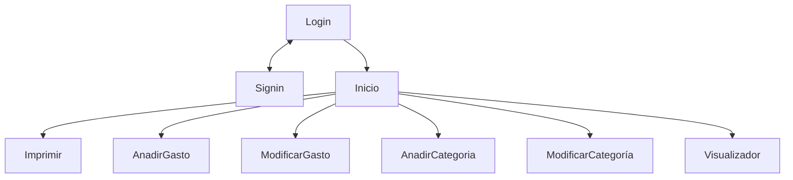
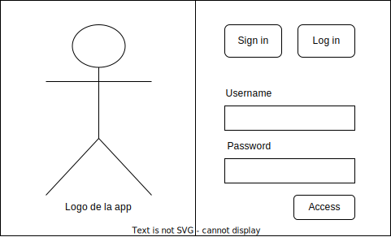

# Proyecto de IPC
Se desea desarrollar una aplicación de escritorio que permita a los usuarios registrados
llevar un control y seguimiento de sus gastos. La aplicación se adaptará al tamaño del
dispositivo donde se ejecute.

Para poder utilizar la aplicación el usuario deberá de estar registrado, una vez registrado
y logueado el usuario podrá acceder a las diferentes funcionalidades de la aplicación. El
usuario debería de poder hacer un logout sin que la aplicación termine.

El usuario podrá añadir en cualquier momento apuntes de gastos a su histórico, así como
visualizar el histórico de todos sus apuntes. De cada apunte se guardará información
como la fecha del gasto, el producto, las unidades y el precio. De manera opcional
también se guardará una imagen del tique o factura para poder ser utilizada para reclamar
la garantía del producto.

Seguidamente se detallan los escenarios de uso que se han obtenido tras el análisis de
requisitos del sistema. Estos se deben utilizarse para diseñar e implementar
adecuadamente la aplicación requerida.

## Puntos a seguir imprescindibles
Estos son los puntos que debemos de seguir si queremos que la app tenga al menos la nota minima.
- [ ] Signin
- [ ] Login
- [ ] Modificacion de perfil
- [ ] Anadir un gasto a la cuenta
- [ ] Modificar un gasto de la cuenta
- [ ] Eliminar un gasto de la cuenta
- [ ] Anadir una categoria de gastos
- [ ] Modificar una categoria de gastos
- [ ] Eliminar una categoria de gastos
- [ ] Visualizador de los gastos de la cuenta
- [ ] Impresion de gasto en PDF

## Proposiciones en imagen de como puede ser la app

### Grafo de funcionamiento de la aplicacion

### Login

### Signin

### Inicio

### Visualizador

### Imprimir
### Anadir Gasto

### Editar Gasto

### AnadirCategoria

### ModificarCategoria

## Modelo de datos
Para el modelo de datos utilizaremos SQLITE, y nos dan ciertas clases para que lo implementemos en el sistema.

### Clase USER

- String name (Nombre)
- String surname (Apellidos)
- String email (Correo)
- String nickName (Usuario)
- String password (Contrasena)
- LocalDate registerDate (Fecha de registro)
- Image image (Avatar)

Para todos los campos existe un setter y un getter que podemos utilizar en el codigo.

### Clase Category

- String name (Nombre)
- String description (Descripcion)

Como cada usuario tendra sus categorias habra que invocarlo desde un metodo de usuario

### Clase Charge

- Int id (Identificador)
- String name (Nombre del gasto)
- String description (Descripcion del gasto)
- Category category (Categoria del gasto)
- Double cost (Coste)
- Int units (Unidades de gasto)
- LocalDate date (Fecha del gasto)
- Image scanImage (Imagen del gasto)

Todos los campos son modificables excepto el ID.

